#### RDS configuration

- Engine: **PostgreSQL**.
- Deployment: **Single-AZ** DB instance for cost optimization.
- Instance class: **db.t4g.micro** for the demo environment.
- Storage: gp3, 20 GiB, autoscaling disabled unless needed.
- Public access: **No**. RDS is accessed from the EC2 backend Security Group.
- Database name: `marketplace`.
- Encryption: default AWS/RDS key.

#### Prisma deployment

Because the project uses **Prisma 7**, the runtime must read `DATABASE_URL` through the adapter configuration, while migrations use Prisma CLI scripts. The backend was adjusted to load dotenv and use `PrismaPg` with SSL settings for RDS.

```bash
cd ~/daiai-aws-MarketplaceV1/backend
npm run generate
node -r dotenv/config ./node_modules/prisma/build/index.js migrate deploy
node prisma/seed-required.js
```

#### Seed data

- Roles: `admin`, `buyer`, `seller`.
- Payment methods: MoMo, ZaloPay, MB Bank, VNPay.
- Categories with group values such as `DOCUMENT` and `MODEL_3D`.
- The production seed uses **upsert only** and must not delete Product, User, Order, or OrderItem records.

#### Verification

```bash
psql -h <RDS-ENDPOINT> -U postgres -d marketplace -p 5432 -c 'SELECT * FROM "Role";'
psql -h <RDS-ENDPOINT> -U postgres -d marketplace -p 5432 -c 'SELECT id, name, "group" FROM "Category" ORDER BY "group", name;'
```

<!-- INSERT FIGURE 5.5: RDS instance summary and Security Group rule showing PostgreSQL access from the EC2 Security Group only. -->
<!-- INSERT FIGURE 5.6: psql query output for Role and Category seed data. -->
### Steps to create RDS
# 1.Engine Settings
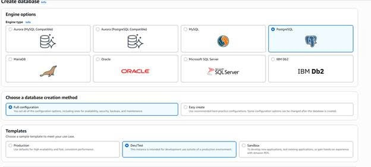
# 2.Availability and durability
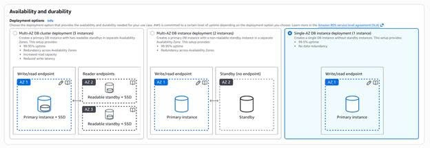
# 3.Settings
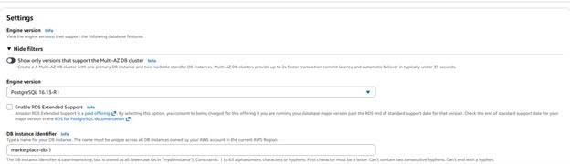
# 4.Credentials Settings
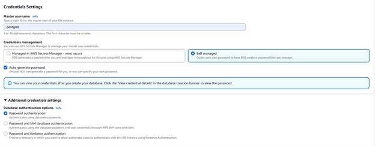
# 5.Instance Configs
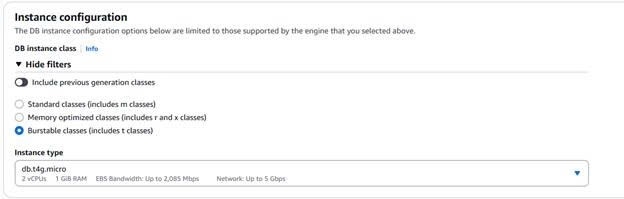
# 6.Storage settings
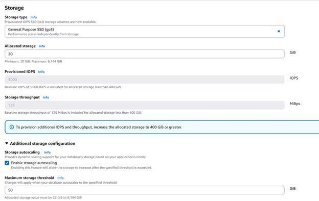
# 7.Connectivity part 1
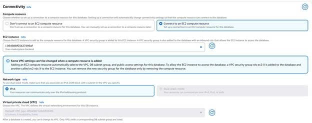
# 8.Connectivity part 2
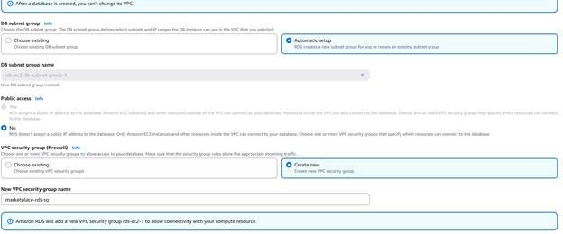
# 9.Connectivity part 3
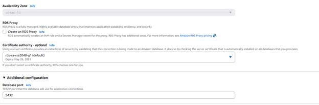
# 10.Monitoring settings
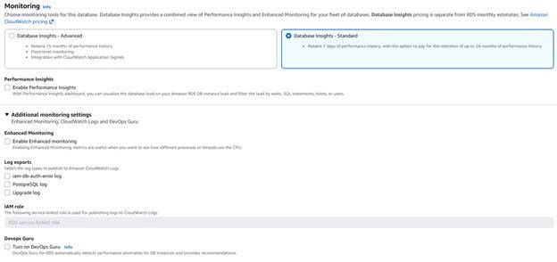
# 11.Additional config part 1
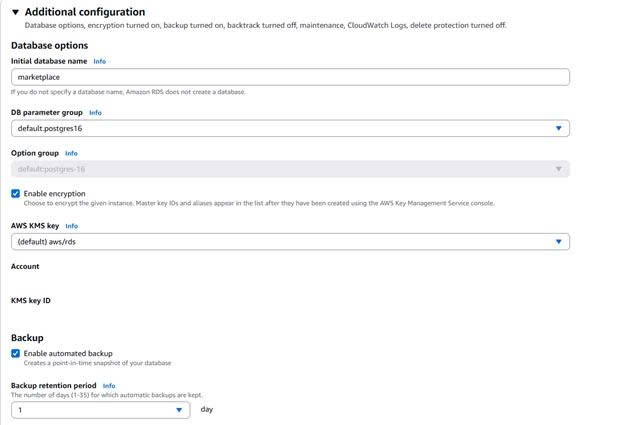
# 12.Additional config part 2
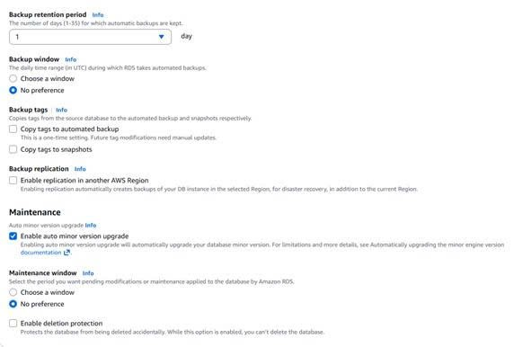
# 13. Estimated monthly costs
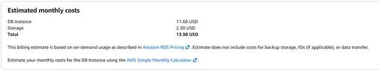