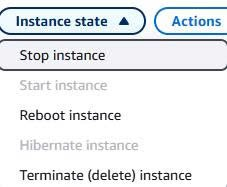
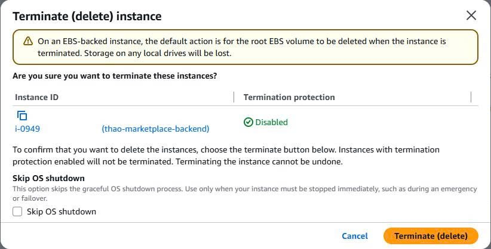
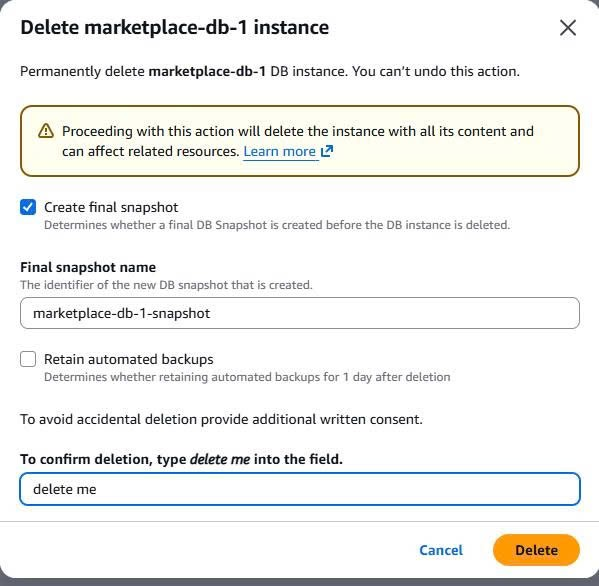
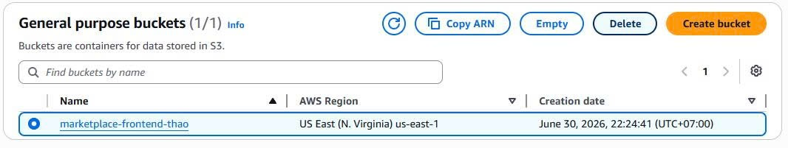
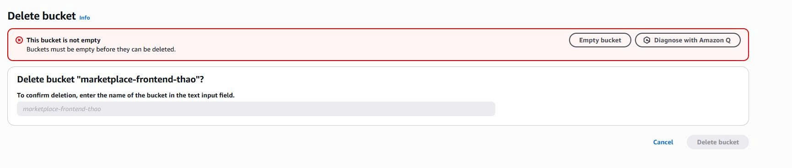
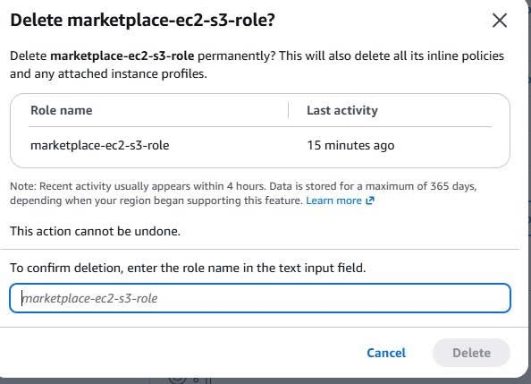

#### Cost-aware design decisions

- No NAT Gateway, no ALB, no Multi-AZ RDS, no paid WAF, no RDS Proxy — the demo runs on the smallest viable footprint.
- AWS Budget alerts are enabled to catch unexpected spend.
- CloudFront, Route 53, and ACM can be used, but we must ensure good cost control and also update Budget alerts for each service used whenever it's available.

#### Cleanup

- Stop or terminate the EC2 instance.    
    + Step 1: Go to AWS Console -> Search EC2 service -> Select the Instance you want to delete -> Click on Instance state -> Terminate (delete) Instance
    
    + Step 2: Press delete and confirm deletion
    

- Delete the RDS instance (take a final snapshot if the data is needed later).

- Empty and delete the S3 bucket, or keep only the `products/` objects that matter.

- Remove the IAM role and inline policy.

- Delete the Vercel project or pause deployments, since Vercel is free, deletion may not be necessary.

#### Next improvements

- HTTPS for the backend via a custom domain with a proxy, ALB, or API Gateway.
- Presigned URLs for direct, time-limited S3 downloads.
- Move secrets to SSM Parameter Store or Secrets Manager.
- CloudWatch logs, metrics, and alarms for the backend.
- Soft delete for products referenced by orders.
- CI/CD pipeline for backend and frontend deployments.